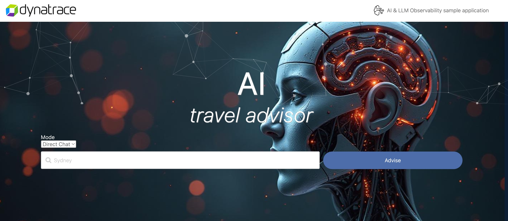

# Enablement Gen AI & LLM Observability

Dynatrace Gen AI & LLM observability provides complete visibility into all aspects of LLMs, including applications, prompts, data sources, and outputs for LLMs' correct, consistent operation at all times across all domains. The Dynatrace Platform can:

- Seamlessly integrate across the full AI application stack
- Help reduce the cost and improve the performance of your AI and LLM stack
- Build trust in LLM inputs and outputs
- Explain and trace back your AI-powered application outputs
- Reduce compliance risk for your Generative AI application

    

In this tutorial we will learn how it is easy to observe an AI application (AI Travel advisor) that uses [Ollama](https://ollama.com/) as Large Language Model, [Weaviate](https://weaviate.io/) as Vector Database, and [LangChain](https://www.langchain.com/) as an orchestrator to create [Retrieval augmented generation (RAG)](https://python.langchain.com/docs/concepts/rag/) and [Agentic](https://python.langchain.com/docs/concepts/agents/) AI Pipelines.

Ready to learn more about Gen AI & LLM Observability? 
## [Yes, let's start the enablement!](https://dynatrace-wwse.github.io/enablement-gen-ai-llm-observability)
